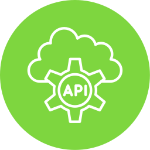

# Spring Boot HTTP Client for VS Code

A VS Code extension that brings IntelliJ IDEA Ultimate's HTTP client functionality to VS Code. Generate HTTP requests directly from your Spring Boot controller methods with a single click!

## Features

🚀 **One-Click HTTP Requests**: Click the CodeLens above any Spring Boot mapping annotation to instantly send an HTTP request

📄 **Generate .http Files**: Create properly formatted .http files compatible with VS Code's REST Client extension

📋 **Copy as cURL**: Generate cURL commands for your API endpoints

🔍 **Smart Parameter Detection**: Automatically detects and handles:
- `@RequestBody` parameters (generates realistic sample JSON)
- `@PathVariable` parameters (substitutes with sample values)
- `@RequestParam` parameters (adds as query parameters)
- `@RequestHeader` parameters (adds as headers)

🎯 **Intelligent Path Resolution**: Combines class-level `@RequestMapping` with method-level mappings

⚙️ **Configurable**: Customizable settings for host, port, environment variables, and more

## Supported Annotations

- `@RequestMapping`
- `@GetMapping`
- `@PostMapping` 
- `@PutMapping`
- `@DeleteMapping`
- `@PatchMapping`

## Usage

1. **Install the extension** and the [REST Client extension](https://marketplace.visualstudio.com/items?itemName=humao.rest-client)

2. **Open a Spring Boot project** with controller classes

3. **Look for CodeLenses** above your mapping annotations:
   ```java
   // <- CodeLens appears here
   @RestController
   @RequestMapping("/api/users")
   public class UserController {
       
       @GetMapping("/{id}")  // <- CodeLens appears here
       public User getUser(@PathVariable Long id) {
           // ...
       }
       
       @PostMapping  // <- And here
       public User createUser(@RequestBody CreateUserRequest request) {
           // ...
       }
   }
   ```

4. **Click the CodeLens options**:
   - 📄 **Generate All Request**: Create a .http file for the REST Client extension that contains all mapped requests in the controller
   - 🚀 **Send Request**: Execute the HTTP request immediately
   - 📄 **Generate .http File**: Create a .http file for the REST Client extension for specific request
   - 📋 **Copy as cURL**: Copy the request as a cURL command

## Generated Examples

### For a GET endpoint with path variable:
```http
### Environment Variables
@host = localhost:8080
@contentType = application/json
@accept = application/json

### Request
GET {{host}}/api/users/123
Accept: {{accept}}

###
```

### For a POST endpoint with request body:
```http
### Environment Variables  
@host = localhost:8080
@contentType = application/json
@accept = application/json

### Request
POST {{host}}/api/users
Content-Type: {{contentType}}
Accept: {{accept}}

{
  "name": "sample",
  "email": "example@email.com",
  "age": 25,
  "active": true
}

###
```

## Configuration

Access settings via `File > Preferences > Settings` and search for "Spring Boot HTTP Client":

- **Enable CodeLens**: Show/hide CodeLens above mapping annotations
- **Use Environment Variables**: Generate .http files with environment variables
- **Default Port**: Default port when not detected from application properties
- **Default Host**: Default host for requests  
- **Show Response in New Tab**: Display HTTP responses in separate editor tabs
- **Request Timeout**: HTTP request timeout in milliseconds

## Smart Features

### 🧠 Automatic Port Detection
The extension automatically detects your Spring Boot application's port and context path from:
- `application.properties` (`server.port=8080`, `server.servlet.context-path=/api`)
- `application.yml`/`application.yaml` (`server.port: 8080`, `server.servlet.context-path: /api`)
- Defaults to 8080 if not found

### 📊 Realistic Sample Data Generation
Instead of empty objects, the extension generates meaningful sample data:
- **Strings**: `"sample"`, `"example"`, `"test"`
- **Numbers**: Random values within reasonable ranges
- **Booleans**: Random true/false
- **Dates**: Current date in appropriate format
- **Collections**: Arrays with sample items
- **Nested Objects**: Recursively generated from referenced classes

### 🔗 Path Variable Substitution
Automatically replaces path variables with appropriate sample values:
- `{id}` → `123`
- `{userId}` → `123` 
- `{uuid}` → `550e8400-e29b-41d4-a716-446655440000`

## Requirements

- VS Code 1.74.0 or higher
- [REST Client extension](https://marketplace.visualstudio.com/items?itemName=humao.rest-client) (recommended for .http file support)
- Java Spring Boot project

## Known Limitations

- Only supports Java Spring Boot projects
- Requires well-formatted Spring annotations
- Complex generic types may not be fully supported or may take longer to generate
- Circular references in model classes are handled with empty objects

## Contributing

Found a bug or want to suggest a feature? Please open an issue on our [GitHub repository](https://github.com/ayoubtoueti/springboot-http-generator).

## License

MIT License - see LICENSE file for details.

---

**Enjoy faster API testing with Spring Boot HTTP Client!** 🚀